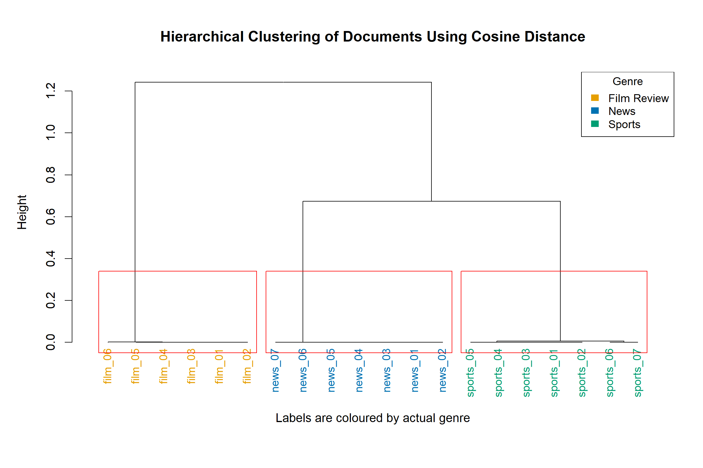
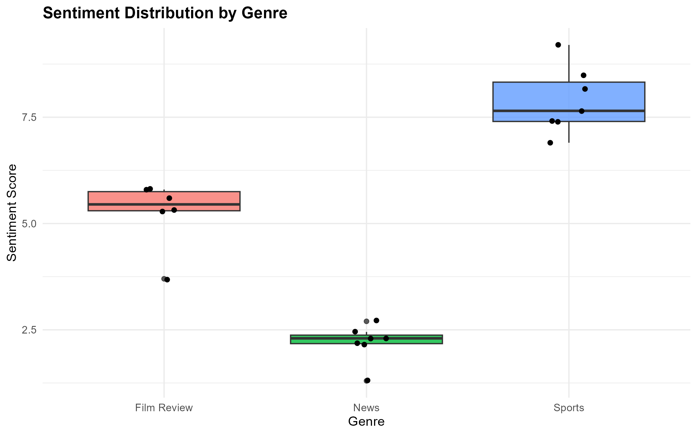
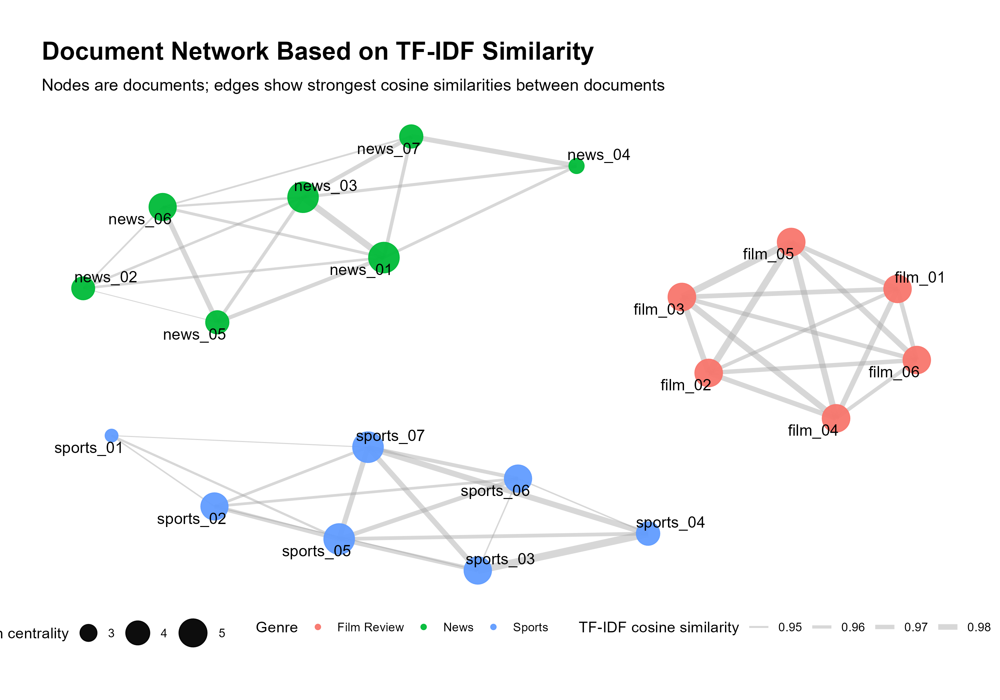
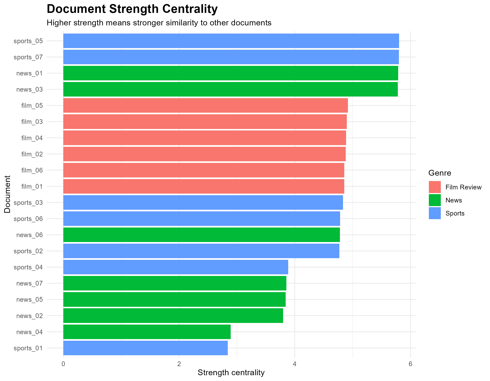
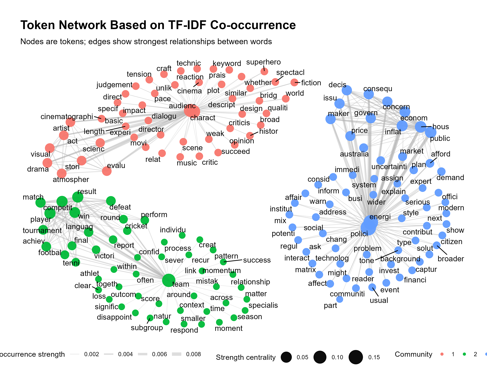
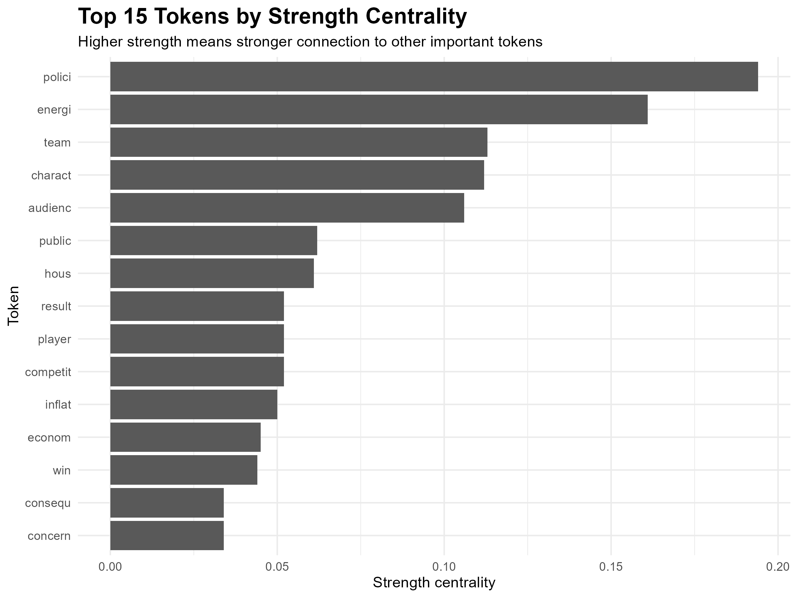
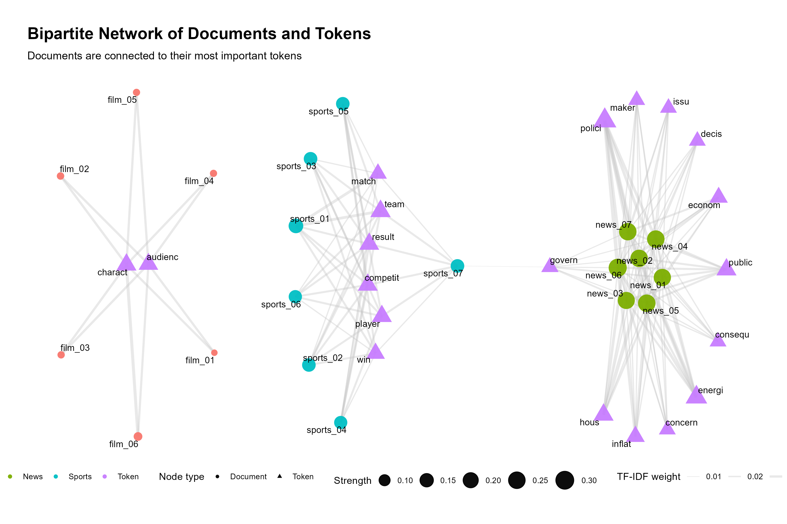

## QUESTION 2: CORPUS COLLECTION

The corpus was created as a CSV file because this format is easy to read in R and allows both text and metadata to be stored together.
The CSV contains 4 main columns **doc_id**, **genre**, **title**, **source**, and **text**. The doc_id column provides a short unique identifier for each document,
which is useful for labelling clusters and network nodes. The genre column stores the known class labels for each document, while the source column records the URL used for
referencing. The text was copied into the text column and checked to ensure that each document was machine-readable.

## QUESTION 3: TEXT PROCESSING AND DTM

```{r}
# 34 tokens
dtm_sparse <- removeSparseTerms(dtm, 0.20)
```

First, the text column from the CSV file was converted into a corpus object. The text was then cleaned by converting all words to lowercase, removing punctuation, removing numbers, removing common English stopwords, and stripping extra whitespace. Stemming was also applied so that related word forms were reduced to a common root form. For example, words such as “playing”, “played”, and “plays” would be treated more consistently.

After cleaning, a Document-Term Matrix was created. This matrix represents each document as a row and each token as a column. The values in the matrix show how often each token appears in each document. Sparse terms were removed using trial and error. Several sparsity thresholds were tested, and a threshold of 0.20 was selected. This produced a final DTM with 34 tokens.

The final DTM was exported as a CSV file and included in the appendix. A token frequency table was also created to identify the most common terms in the corpus.

## QUESTION 4: HIERARCHICAL CLUSTERING

```{r q4-dendrogram, echo=FALSE, out.width="100%", fig.align="center"}

```

Hierarchical clustering was used to examine whether the documents naturally grouped according to their labelled genres. The clustering was performed using the cleaned Document-Term Matrix created in Question 3. Each document was represented by its frequency pattern across the final selected tokens.

Cosine distance was used because it is appropriate for text data. Documents in the corpus may vary in length, so comparing raw word counts alone could be misleading. Cosine distance focuses on the pattern of token usage rather than only the total number of words. This makes it suitable for comparing news articles, sports articles, and film reviews.

The hierarchical clustering was performed using Ward’s method and the dendrogram was cut into three clusters, matching the three known genres in the corpus. The dendrogram shows a very clear separation between the three document groups. Film review documents form one cluster, news documents form another cluster, and sports documents form a third cluster.

The quantitative clustering result was evaluated using a genre-by-cluster table. The table showed that all six film review documents were placed in one cluster, all seven news documents were placed in a second cluster, and all seven sports documents were placed in a third cluster. Using the majority genre in each cluster, the clustering accuracy was 100%.

This result suggests that the selected tokens were effective at distinguishing the three genres. The film review documents likely shared vocabulary related to films, characters, performances, stories, and reviews. The sports documents shared vocabulary linked to matches, teams, players, and competition. The news documents shared broader reporting-style vocabulary. Because there was no mixing between the three genres, the clustering result provides strong evidence that the corpus has a clear genre-based structure.

## QUESTION 5: SENTIMENT ANALYSIS

```{r q5-sentiment-plot, echo=FALSE, out.width="90%", fig.align="center"}

```

```{r appendix-anova, echo=FALSE}
knitr::kable(
  as.data.frame(summary(anova_result)[[1]]),
  caption = "ANOVA Results Comparing Sentiment Scores Across Genres",
  digits = 4
)
```

The results showed clear differences between the three genres. Sports documents had the highest average sentiment score, with a mean of 7.89 and a range from 6.90 to 9.20. Film reviews had a moderate average sentiment score of 5.25, with scores ranging from 3.70 to 5.80. News documents had the lowest average sentiment score, with a mean of 2.20 and a range from 1.30 to 2.70.

These results suggest that the sports documents used more positive language, possibly because they discussed performance, competition, achievement, and successful outcomes. Film reviews showed a moderate sentiment level, which is expected because reviews often contain a mixture of praise and criticism. News documents had the lowest sentiment scores, which may reflect the more neutral, factual, or serious tone commonly used in news reporting.

To test whether the differences between genres were statistically significant, a one-way ANOVA was conducted using sentiment score as the dependent variable and genre as the independent variable. The ANOVA result was statistically significant, F(2, 17) = 121.1, p = 8.76e-11. This indicates that sentiment scores differed significantly between the three genres.

The boxplot supports this result visually. Sports documents form the highest sentiment group, news documents form the lowest sentiment group, and film reviews sit between them. There is very little overlap between the three genre distributions, which strengthens the conclusion that sentiment varies meaningfully by genre.

However, the dictionary-based method has limitations. It counts words based on predefined sentiment values and may not fully understand context, sarcasm, negation, or domain-specific meaning. For example, a word that is positive in one context may be neutral or negative in another. Despite this limitation, the sentiment analysis provides useful quantitative evidence that the genres differ in emotional tone.

## QUESTION 6: DOCUMENT NETWORK ANALYSIS

A single-mode document network was created to examine relationships between the documents in the corpus. In this network, each node represents one document, and each edge represents a similarity relationship between two documents. Instead of using raw word counts only, I used a TF-IDF weighted Document-Term Matrix. TF-IDF was used because it gives more importance to distinctive terms and reduces the influence of common terms that appear across many documents.

Cosine similarity was then calculated between each pair of documents. This similarity measure compares the pattern of term usage between documents rather than simply comparing document length. The strongest similarity relationships were retained to create the final document network. This made the graph easier to interpret and helped highlight meaningful document relationships.

```{r q6-document-network, echo=FALSE, out.width="100%", fig.align="center"}

```

The document network shows three clear groups that correspond closely to the three genres in the corpus: sports, news, and film reviews. The sports documents form one cluster, the news documents form another cluster, and the film review documents form a third cluster. This suggests that the documents within each genre share distinctive vocabulary patterns. The result also supports the hierarchical clustering result from Question 4, where the documents were also separated clearly by genre.

Community detection was performed using the Louvain method. The detected communities matched the genre structure of the corpus, which indicates that the network structure is meaningful rather than random. The graph was improved beyond a basic network plot by using node colour to show genre, node size to represent strength centrality, and edge width to represent TF-IDF cosine similarity.

```{r q6-document-strength, echo=FALSE, out.width="90%", fig.align="center"}

```

Strength centrality was used to identify the most important documents in the network. A document with higher strength centrality has stronger overall similarity to other documents. The most central documents were `sports_05`, `sports_07`, `news_01`, and `news_03`. These documents had the highest strength centrality scores, meaning they shared strong vocabulary patterns with other documents in the network. Film review documents such as `film_05` and `film_03` were also relatively central within their genre group.

```{r q6-centrality-table, echo=FALSE}
doc_centrality %>%
  arrange(desc(strength)) %>%
  select(doc_id, genre, community, degree, strength, betweenness, sentiment) %>%
  head(5) %>%
  knitr::kable(
    caption = "Top 5 documents by strength centrality",
    digits = 3
  )
```

## QUESTION 7: TOKEN NETWORK ANALYSIS

```{r q7-token-network, echo=FALSE, out.width="100%", fig.align="center"}

```

```{r q7-top-tokens, echo=FALSE, out.width="90%", fig.align="center"}

```

```{r q7-token-table, echo=FALSE}
token_centrality %>%
  select(token, community, degree, strength, betweenness) %>%
  head(10) %>%
  knitr::kable(
    caption = "Top 10 tokens by strength centrality",
    digits = 3
  )
```

A token network was constructed to examine relationships between important words within the corpus. Unlike the document network in Question 6, the nodes in this network represent tokens rather than documents. Edges connect words that frequently appear together within documents. TF-IDF weighting was used to reduce the influence of common terms and highlight more informative vocabulary.

The resulting network revealed three major communities. Community 1 contained terms associated with film reviews, including words such as *character*, *audience*, *movie*, *director*, *scene*, and *dialogue*. Community 2 contained sports-related vocabulary, including *team*, *player*, *competition*, *result*, *match*, and *win*. Community 3 contained news and public affairs terminology, including *policy*, *energy*, *inflation*, *economy*, *government*, *public*, and *housing*.

Several highly central tokens were identified using strength centrality. The most important tokens were *policy* (0.194), *energy* (0.161), *team* (0.113), *character* (0.112), and *audience* (0.106). These words occupy central positions within their respective communities and act as important connectors between related terms. The high centrality values suggest that these words are representative of the major themes present within the corpus.

## QUESTION 8: BIPARTITE NETWORK ANALYSIS

```{r q8-bipartite, echo=FALSE, out.width="100%", fig.align="center"}

```

```{r q8-centrality-table, echo=FALSE}
bipartite_centrality %>%
  head(10) %>%
  knitr::kable(
    caption = "Most central nodes in the bipartite network",
    digits = 3
  )
```

A bipartite (two-mode) network was constructed to examine relationships between documents and important tokens. Unlike the previous document and token networks, this network contains two different node types. Document nodes represent individual documents within the corpus, while token nodes represent important words identified from the TF-IDF analysis. Edges indicate that a token appears within a document, with edge weights based on TF-IDF values.

The resulting network reveals a clear separation between the three document genres. Film review documents are primarily connected to tokens such as *character* and *audience*, reflecting the evaluative nature of movie reviews. Sports documents are strongly connected to tokens including *team*, *player*, *competition*, *result*, *win*, and *match*, which represent the main themes within sports reporting. News documents are associated with policy and economic terminology such as *policy*, *energy*, *inflation*, *economy*, *housing*, and *public*.

Several highly central nodes were identified using strength centrality. The most important document nodes were *news_06*, *news_05*, *news_04*, and *news_07*, indicating that these documents were strongly connected to multiple important keywords. Among the token nodes, *policy*, *energy*, *team*, *public*, and *housing* achieved the highest centrality values. These keywords therefore represent the most influential concepts within the corpus.

The bipartite network provides a direct link between documents and vocabulary, making it possible to identify which keywords drive the structure of each genre. While the document network focuses on relationships between documents and the token network focuses on relationships between words, the bipartite network combines both perspectives and provides a more comprehensive view of the corpus structure.

## QUESTION 9: SUMMARY OF THE REPORT

This assignment applied several Natural Language Processing (NLP) techniques to analyse a corpus containing news articles, sports articles, and film reviews. The analysis included document clustering, sentiment analysis, document networks, token networks, and bipartite networks.

The clustering analysis demonstrated that the documents could be grouped accurately according to their underlying genre. Hierarchical clustering produced three clearly separated clusters corresponding to sports, news, and film review documents. The clustering evaluation achieved 100% accuracy when compared against the known document categories. This result suggests that the vocabulary used within each genre is highly distinctive and that document similarity can successfully identify thematic groupings.

Network analysis provided a different perspective on the same data. While clustering focuses on grouping documents into categories, network analysis focuses on the relationships between documents and words. The document network revealed how strongly documents were connected to one another through shared vocabulary, while the token network revealed thematic communities of words. The bipartite network further connected these two perspectives by directly linking documents with their most important keywords. Together, the network approaches provided a richer understanding of the corpus structure than clustering alone.

Several improvements were made beyond the basic NLP workflow presented in class. TF-IDF weighting was used to emphasise informative words while reducing the influence of common terms. Sparse terms were removed to reduce noise and improve interpretability. Cosine similarity was used to measure document similarity, providing a more meaningful comparison of document content. Community detection algorithms were applied to both document and token networks to identify hidden structures within the data. Centrality measures were also calculated to identify influential documents and keywords.

Overall, the analysis successfully demonstrated how clustering and network methods can be used together to explore textual data. The combination of these approaches provided a comprehensive understanding of the corpus and highlighted the major themes present within each genre.

## Appendix: 

### Q3: Text Processing

```{r}
# Create corpus
text_corpus <- VCorpus(VectorSource(corpus_df$text))

# Convert to lowercase
text_corpus <- tm_map(text_corpus, content_transformer(tolower))

# Remove punctuation
text_corpus <- tm_map(text_corpus, removePunctuation)

# Remove numbers
text_corpus <- tm_map(text_corpus, removeNumbers)

# Remove stopwords
text_corpus <- tm_map(text_corpus, removeWords, stopwords("english"))

# Apply stemming
text_corpus <- tm_map(text_corpus, stemDocument)

# Create DTM
dtm <- DocumentTermMatrix(text_corpus)

# Convert dtm to matrix
dtm_matrix <- as.matrix(dtm_sparse)

# Add document IDs as row names
rownames(dtm_matrix) <- corpus_df$doc_id
```

### Q4: Hierarchical Clustering

```{r}
# Cosine distance
cos_dist <- proxy::dist(dtm_matrix, method = "cosine")

# Hierarchical clustering
hc <- hclust(cos_dist, method = "ward.D2")

# Cluster assignment
cluster_assignments <- cutree(hc, k = 3)
```

### Q5: Sentiment Analysis

```{r}
# Get sentiment score for each document
sentiment_scores <- get_sentiment(
  corpus_df$text,
  method = "syuzhet"
)

# Create results table
sentiment_df <- data.frame(
  doc_id = corpus_df$doc_id,
  genre = corpus_df$genre,
  sentiment = sentiment_scores
)


# Genre summary
genre_sentiment <- aggregate(
  sentiment ~ genre,
  data = sentiment_df,
  FUN = mean
)

# Anova Result
anova_result <- aov(
  sentiment ~ genre,
  data = sentiment_df
)
```